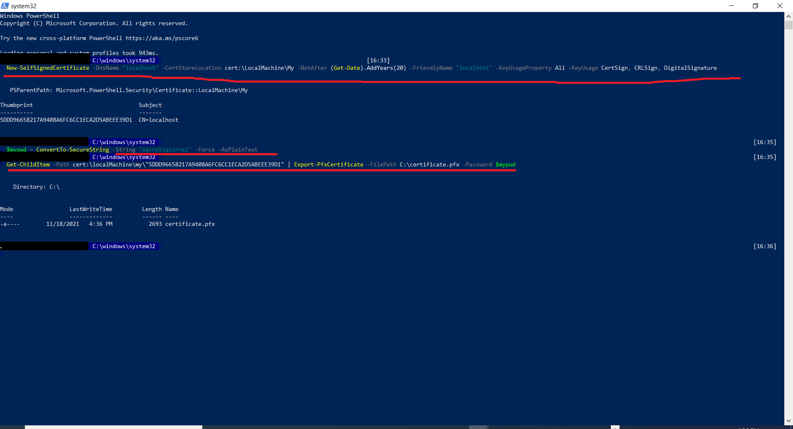

Follow the below steps to create Server Client Authentication certificate and include the same in server and client application

1. Run the following command and capture the Thumbprint
```powershell
New-SelfSignedCertificate -DnsName "localhost" -CertStoreLocation cert:\LocalMachine\My -NotAfter (Get-Date).AddYears(20) -FriendlyName "localhost" -KeyUsageProperty All -KeyUsage CertSign, CRLSign, DigitalSignature
```
2. Run this script to set the password to local variable
```powershell
 $mypwd = ConvertTo-SecureString -String "secretsquirrel" -Force -AsPlainText
```
3. Replace the "The Thumbprint.." with the value captured in step 1 and the Filepath in the following script
```powershell
Get-ChildItem -Path cert:\localMachine\my\"The thumbprint..." | Export-PfxCertificate -FilePath C:\certificate.pfx -Password $mypwd
```

## Script Image



3. Follow the steps to include the certificate under trusted root

   - Run MMC
   - Select File > Add or Remove Snap-ins
   - Select Certificates and then click Add
   - Select Computer account and press Next
   - Select Local computer, then click Finish. Then Click OK. 
   - Find the certificate in Personal > Certificates
   - Right-click on the created certificate and choose Copy
   - Expand Trusted Root Certificate Authorities
   - Right-click on the Certificates folder
   - Select Paste


**Untrusted certificates should only be used during app development. Production apps should always use valid certificates.**
